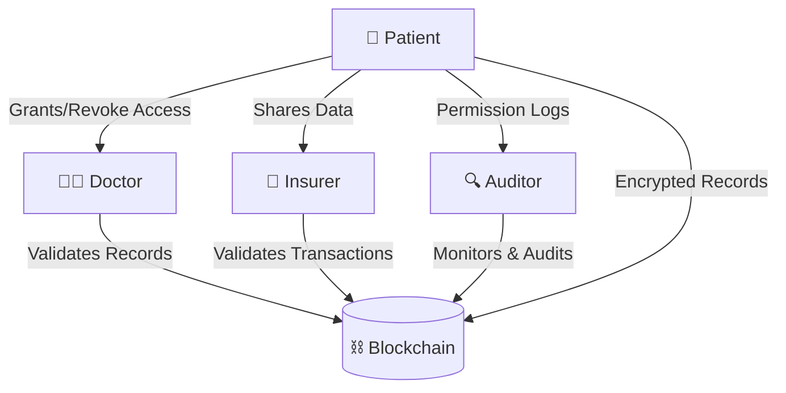

# 🧬 Histo-Bit

**Decentralized, encrypted, and patient-centered medical records system powered by blockchain.**

---

## 🌍 Problem

Today, hospitals, insurers, and clinics hold full control over patients’ medical data.  
This creates critical issues:

- ❌ Limited portability between providers  
- ❌ Security risks and vulnerability to data breaches  
- ❌ Centralized dependency on siloed systems  
- ❌ Lack of patient autonomy over their own information  

Patients often cannot decide **who** accesses their records, **when**, or **for how long**—while still needing confidentiality of their health conditions.

---

## 💡 Our Vision

**Histo-Bit empowers patients to be the true owners of their medical records.**

- Patients decide who can view their data and for how long.  
- Medical records become **portable**, moving securely between providers.  
- Data is encrypted and stored, ensuring confidentiality.  
- Patients can **monetize** anonymized statistics by sharing them (if they choose) with insurers, hospitals, or researchers.

---

## 👥 Actors and Roles

- **Patients** → Own their data; manage permissions (read/write/share).  
- **Doctors** → Validate and generate clinical information stored on-chain.  
- **Insurers** → Manage insured lists.  
- **Auditors** → Oversee activity, transactions, and compliance.  

---

---

## 🔐 Security & Privacy

- **Encryption**: All sensitive data is encrypted before storage.  
- **Private on Blockchain**: Medical data stored as encrypted and signed references/hashes, with large files (e.g., medical images) offloaded to **IPFS**.  
- **Advanced Cryptography**:  
  - Baby Jubjub curve  
  - Partial Homomorphic Encryption  
  - Zero Knowledge Proofs (ZKPs) → transactions validated without revealing private data  
- **Key Management**: Based on biometric proof of human identity/presence and Self Protocol App.  

---

## ⚙️ Technical Architecture

### Smart Contracts
- **Access & Role Contract** → Defines patient, doctor, insurer, auditor permissions.  
- **Medical Records Contract** → Stores only encrypted references (IPFS, Signs and Docs Hashes).  
- **Transactional Contract** → Fully auditable log of access and modifications.  
- **Consent Management** → Patients decide *what* to share and *for how long*.  
- **Encrypted Token** → Manages identity and digital assets (eERC20).  

---

## 📱 Applications & UX

- **Patients** → Access medical history, control permissions, monetize statistics  
- **Doctors** → Validate and write clinical records  
- **Insurers** → Administrative dashboards
- **Auditors** → Monitor user activities and compliance  

Web and mobile apps will deliver role-specific interfaces.  
**MVP focus** → Patient-friendly, intuitive flows.

---

## 🚀 Development Roadmap

### Stage 1
- Core smart contracts (access, storage, transactions)  
- Encryption logic & security tests (Hardhat)  
- Simulated data on Hash, Sign and IPFS + permission workflows UI  

### Stage 2
- Integrate audit layer  
- Permission control dashboards  
- ZKP-based privacy tests  

### Stage 3
- Network stress testing (multi-user scenarios)  
- Role simulation (patients, doctors, insurers, auditors)  
- Technical + executive documentation for public launch  

---

## 📊 Value Proposition

- **Patient-Centric** → Ownership and control of medical data  
- **Secure** → End-to-end encryption + blockchain immutability  
- **Interoperable** → Portability between healthcare providers  
- **Transparent & Auditable** → Every access/modification is logged  
- **Incentivized** → Patients can tokenize and monetize anonymized statistics  

---

## 📌 Current Status

🚧 **Development Phase**: Histo-Bit is currently under active development.  
The full documentation outlines the final vision and technical design, while this repository hosts the ongoing implementation.  

---

## 🤝 Contributing

We welcome contributions to the project!  
Check our [issues](./issues) or open a pull request to help shape the future of decentralized healthcare.

---

